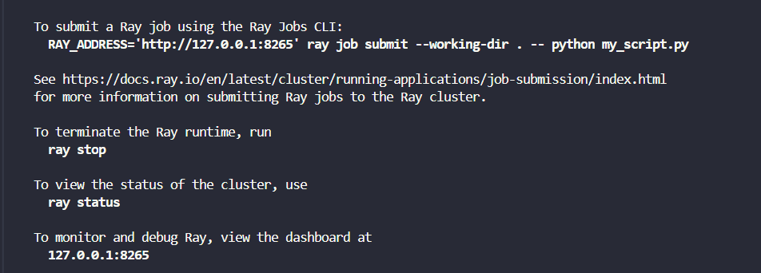

# Ray Framework Lab

This repository contains a hands-on lab exploring Ray, a powerful framework for distributed computing in Python. The lab consists of several tasks demonstrating different capabilities of Ray, from basic parallel execution to distributed machine learning workflows.

## Table of Contents
1. [Environment Setup](#environment-setup)
2. [Task 1: Basic Ray Execution](#task-1-basic-ray-execution)
3. [Task 2: Parallel Data Processing](#task-2-parallel-data-processing)  
4. [Task 3: Resource Management (GPU)](#task-3-resource-management-gpu)
5. [Task 4: Distributed Machine Learning](#task-4-distributed-machine-learning)

## Environment Setup

### Creating a Virtual Environment

A Python virtual environment was created to isolate dependencies for this lab:

### Installing Dependencies

Required dependencies are listed in the `requirements.txt` file and include:
- ray==2.47.0
- numpy==2.3.0
- scikit-learn
- And other supporting libraries

### Starting the Ray Cluster

A local Ray cluster was started to handle distributed computing tasks:

### Verifying Connection

The connection to the Ray cluster can be verified using the `connection.py` script:

### Checking Cluster Status

The Ray dashboard provides insights into the cluster's status:

## Task 1: Basic Ray Execution

This task demonstrates the fundamental concept of Ray's parallel execution by comparing sequential function calls with Ray's parallel remote execution.

### Key Concepts:
- Remote functions with `@ray.remote` decorator
- Converting functions to Ray tasks
- Object references and result retrieval with `ray.get()`
- Performance comparison between sequential and parallel execution

### Implementation Details:
The `task1.py` script:
1. Defines a regular Python function that squares a number
2. Creates a Ray remote version of the same function
3. Executes both sequentially and in parallel
4. Compares execution times

### Results:

## Task 2: Parallel Data Processing

Task 2 showcases Ray's ability to process large datasets in parallel, demonstrating significant performance improvements over sequential processing.

### Key Concepts:
- Scaling to larger datasets
- Applying functions to each element of a dataset
- Performance benefits with computationally intensive operations

### Implementation Details:
The `task2.py` script:
1. Creates a large dataset (1,000,000 random numbers)
2. Processes each element with a non-trivial mathematical calculation
3. Compares sequential processing time with Ray parallel processing
4. Shows Ray's scalability advantages

### Results:

## Task 3: Resource Management (GPU)

This task demonstrates Ray's resource management capabilities, particularly with GPU resources. It shows how Ray can manage GPU allocation for tasks that require specialized hardware.

### Key Concepts:
- Resource specification with `@ray.remote(num_gpus=1)`
- Automatic resource scheduling and queuing
- Task-to-resource mapping

### Implementation Details:
The `task3.py` script:
1. Defines a remote function that requests GPU resources
2. Simulates GPU-intensive tasks
3. Shows how Ray manages resource allocation when multiple tasks compete for limited resources
4. Verifies task execution on nodes with the requested resources

### Results:

## Task 4: Distributed Machine Learning

The final task demonstrates how Ray can be used for distributed machine learning workflows, implementing a parallel K-Fold cross-validation process.

### Key Concepts:
- Distributed ML training
- Ray's object store for sharing large datasets
- K-Fold cross-validation in parallel
- Performance benefits for ML training pipelines

### Implementation Details:
The `task4.py` script:
1. Loads the Iris dataset
2. Places the dataset in Ray's object store for efficient sharing
3. Implements a remote function for training and evaluating models on data folds
4. Executes 5-fold cross-validation in parallel
5. Aggregates results and computes average performance

### Results:

## Cluster Dashboard

Ray provides a comprehensive dashboard for monitoring cluster resources, tasks, and performance:

## Conclusion

This lab demonstrates how Ray makes distributed computing accessible in Python, enabling significant performance improvements through parallel execution, efficient resource management, and simplified distributed machine learning. The demonstrated tasks show a progression from basic concepts to more advanced use cases, highlighting Ray's flexibility and power.

## Requirements

For a full list of dependencies, see `requirements.txt`.
